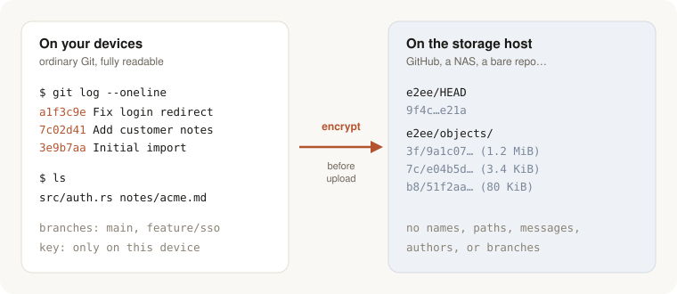

<h1 align="center">git-remote-e2ee</h1>

<p align="center">
  <strong>Git your host can't read.</strong><br />
  End-to-end encrypted Git remotes. Keep using <code>clone</code>, <code>pull</code>, and <code>push</code>;
  GitHub, a NAS, or any other storage only ever holds ciphertext.
</p>

<p align="center">
  <a href="https://github.com/combinatrix-ai/git-remote-e2ee/actions/workflows/ci.yml"></a>
  <a href="#license"></a>
  
</p>

<p align="center">
  <a href="#quick-start">Quick start</a>
  · <a href="#how-it-compares">How it compares</a>
  · <a href="docs/design.md">Design</a>
  · <a href="docs/spec.md">Specification</a>
</p>

<p align="center">
  
</p>

> [!WARNING]
> This is an early prototype. The repository format is unstable and may change
> without a migration path. Do not use it as your only copy of anything: keep an
> independent copy of every repository and every key.

## Why end-to-end encryption?

**"Private" on a Git host means private from other people, not from the host.**
A private GitHub or GitLab repository is stored in a form the provider can read:
every file, every commit message, every branch name, and who wrote what. That is
what lets the host show you diffs and run CI, but it also means your code and
notes are readable by anyone who gets access to the host's side: a breach, a
leaked access token or third-party app, an insider, a legal demand, or a policy
change you did not choose.

**End-to-end encryption (E2EE) moves the keys to your devices.** Your repository
is encrypted on your computer before it is uploaded, and only devices you have
authorized can decrypt it. The host stores data it cannot read. If the host is
breached or compelled to hand over your repository, there is nothing readable
to hand over. If someone tampers with the stored data, your clients notice and
refuse it.

With `git-remote-e2ee` this happens underneath Git. You add a remote with an
`e2ee::` URL and keep working exactly as before.

**Good fits:** personal notes and journals, research before publication, client
or NDA work that must live on third-party storage, private configuration, and
backups on storage you do not control.

**What you give up:** because the host cannot read the repository, it cannot
show it to you either. There are no web diffs, pull-request reviews, code
search, or hosted CI on the plaintext. You are also responsible for your keys:
if every authorized key is lost, the data cannot be recovered by anyone.

## Why git-remote-e2ee

Encrypting Git is not new. File-level tools such as
[`git-crypt`](https://github.com/AGWA/git-crypt) encrypt selected files, and
[`git-remote-gcrypt`](https://github.com/spwhitton/git-remote-gcrypt) has
encrypted whole repositories with GnuPG for years. `git-remote-e2ee` hides the
whole repository like gcrypt, and fixes what makes that painful to live with:

- **Fast: pushes upload only what changed.** A push uploads the new Git pack
  plus a little metadata (3–4 KiB in total for a tiny commit with one device),
  on every backend. gcrypt re-uploads the entire history on every push to a Git
  or SFTP backend such as GitHub, and can repack without warning. One caveat
  today: with a Git host as storage, each operation first clones the whole
  encrypted carrier repository, so downloads are not yet incremental there.
- **Safe: no silent force pushes.** Fast-forward checks run on the client, and
  the storage moves `HEAD` only by compare-and-swap. When two people push at
  once, one wins and the other gets an ordinary rejection. With gcrypt every
  push is effectively a force push, so a push made without pulling first can
  erase someone else's work.
- **No master key: nothing long-lived is shared.** git-crypt protects a
  repository with one symmetric key that every collaborator ends up holding,
  and it cannot revoke anyone. `git-remote-e2ee` creates a fresh random key for
  every push and wraps it separately for each authorized device's own key. An
  administrator can revoke one device without rewriting history, and it
  receives nothing published afterwards.

Under the hood, Git runs on your machine as usual. The helper encrypts the
packs and refs Git hands it, uploads them as opaque immutable objects, and then
atomically moves one opaque `HEAD` pointer. Storage backends today: a **local
or mounted directory**, and **any ordinary Git remote** (GitHub, GitLab, a bare
repository) used as a ciphertext carrier.

## Quick start

Install from source (a Rust toolchain is required). This installs both
`git-e2ee`, the setup CLI, and `git-remote-e2ee`, the helper Git calls for
`e2ee::` URLs. Both must be on `PATH`.

```console
cargo install --git https://github.com/combinatrix-ai/git-remote-e2ee
```

Use an empty GitHub repository as encrypted storage and push an existing
project to it:

```console
git-e2ee keygen --output ~/.config/git-e2ee/notes.key.json
git-e2ee carrier-init \
  --remote https://github.com/you/notes-encrypted.git \
  --key ~/.config/git-e2ee/notes.key.json

cd my-notes
git remote add private 'e2ee::git+https://github.com/you/notes-encrypted.git'
git config remote.private.e2ee-key ~/.config/git-e2ee/notes.key.json
git push -u private main
```

From then on, `git pull` and `git push` work as usual. The key file stays on
your machine; never commit it, and keep a backup somewhere safe.

To use a second machine, give it its own key and authorize its public half.
The [user guide](docs/guide.md#add-a-second-device) walks through it, as well as
the directory backend, cloning, and revoking devices.

## How it compares

There are two kinds of encrypted-Git tools. **File-level tools**, represented
here by [`git-crypt`](https://github.com/AGWA/git-crypt), encrypt the contents
of selected files inside an otherwise normal repository. **Encrypted remotes**,
[`git-remote-gcrypt`](https://github.com/spwhitton/git-remote-gcrypt) and
`git-remote-e2ee`, encrypt the whole repository, history included.

### What the storage host can learn

| | Private repo | `git-crypt` | `git-remote-gcrypt` | `git-remote-e2ee` |
|---|:---:|:---:|:---:|:---:|
| Contents of files you chose to protect | visible | hidden | hidden | hidden |
| Contents of all other files | visible | visible | hidden | hidden |
| File names and directory layout | visible | visible | hidden | hidden |
| Commit messages, authors, and dates | visible | visible | hidden | hidden |
| Branch names and the commit graph | visible | visible | hidden | hidden |
| Which files changed, their sizes, identical files | visible | visible¹ | hidden | hidden |
| When you push, and roughly how much | visible | visible | visible | visible |
| Collaborators | account list | key fingerprints² | count only³ | count only (padded)⁴ |

### What each tool can do

| | `git-crypt` | `git-remote-gcrypt` | `git-remote-e2ee` |
|---|:---:|:---:|:---:|
| Normal `clone`, `pull`, and `push` | ○ | ○ | ○ |
| GitHub or GitLab as storage | ○ | △⁵ | △⁶ |
| Hosted diffs, review, and search for unencrypted parts | ○ | × | × |
| Encrypt only selected files | ○ | × | × |
| Push uploads only new data | △⁷ | △⁵ | ○ |
| Concurrent pushes can't silently overwrite each other | ○ | ×⁸ | ○ |
| Tampering detected | △⁹ | ○ | ○ |
| No long-lived key shared by every collaborator | ×¹⁰ | ○ | ○ |
| Only administrators can change membership | × | ×¹¹ | ○ |
| Revoke one collaborator | ×¹² | ×¹³ | ○¹⁴ |
| Separate reader and writer roles | × | × | △¹⁵ |
| Detects a rolled-back or forked remote | × | × | △¹⁶ |
| Works without GnuPG | ○¹⁰ | × | ○ |
| Tags and remote branch deletion | ○ | ○ | ×¹⁷ |
| Mature, stable format | ○ | ○ | × |
| Cryptography | AES-256-CTR, HMAC-SHA1 SIV | OpenPGP (GnuPG) | XChaCha20-Poly1305, HPKE (X25519), Ed25519 |

○ supported · △ with caveats · × not supported

1. git-crypt's README states that it does not hide when a file changes, its
   length, or whether two files are identical.
2. In git-crypt's GPG mode, the repository key is encrypted to each user and
   committed under `.git-crypt/`, named by key fingerprint.
3. gcrypt hides recipient key IDs by default (`gpg -R`); the number of
   encrypted-key packets is still observable.
4. The envelope list is padded to the next power of two, with a minimum of
   four. Public keys, roles, and membership changes are encrypted, though size
   patterns may suggest a transition. Do not reuse device keys between
   repositories.
5. gcrypt is incremental with its local and rsync backends, but its
   [documentation](https://manpages.debian.org/trixie/git-remote-gcrypt/git-remote-gcrypt.1.en.html)
   says a Git or SFTP backend uploads the entire history on every push, and it
   may repack the remote without warning.
6. Pushes upload only new data, but the current implementation clones the whole
   carrier repository for each operation, so every fetch and push also
   downloads the full encrypted history until a persistent cache lands. With a
   directory as storage, both directions are incremental.
7. A changed encrypted file becomes a new, unrelated ciphertext blob, so Git
   cannot delta-compress it against the previous version.
8. Every gcrypt push is effectively a force push. Its explicit-force option
   prevents accidents but does not coordinate concurrent writers.
9. git-crypt authenticates encrypted file contents; file names, history, and
   which files are encrypted are ordinary Git data.
10. git-crypt uses one symmetric repository key for the life of the
    repository. GPG mode wraps that same key to each user's GPG key; without
    GPG, everyone shares the same exported key file.
11. gcrypt's recipient list is the local `gcrypt.participants` setting of
    whoever pushes, so any participant who can push decides who can read the
    next state.
12. git-crypt's README states that it does not support revoking access.
13. A participant can be dropped from `gcrypt.participants`, but gcrypt does
    not document a revocation workflow.
14. Revocation publishes a fresh key without rewriting history. It cannot take
    back data the device already had.
15. The protocol separates reader, writer, and administrator, but the CLI
    currently grants either read and write, or read, write, and administration.
16. A clone that has synced before rejects rollback or a diverging history. A
    brand-new clone cannot tell without an external anchor; see
    [Security model](#security-model).
17. Pushes are limited to `refs/heads/*` for now. Tag pushes and branch
    deletion fail without publishing anything.

### When another tool is a better fit

- **git-remote-gcrypt**: you want an established tool with a stable format,
  already use GPG, and work alone or can coordinate pushes.
- **A file-level tool such as git-crypt**: only a few files are secret, and you
  want GitHub or GitLab to keep working normally for the rest.
- **An ordinary private repository**: you trust the host and want pull
  requests, search, previews, and CI.

## Security model

The storage provider is treated as malicious. `git-remote-e2ee` aims to
guarantee:

- confidentiality of inner contents and Git metadata: files, paths, refs,
  object IDs, authors, and messages;
- authenticity and integrity of every fetched state;
- continuity for a clone that has synced before, so rollback and forks are
  rejected;
- that revoked devices get no keys for anything published after revocation.

It does **not** prevent:

- the host deleting data or refusing service;
- a brand-new clone being shown an old or forked history, or different clients
  being shown different histories (that needs an external anchor, which is on
  the roadmap);
- an authorized writer making destructive changes;
- a revoked device reading what it could read before revocation;
- traffic analysis: update times, object sizes, total growth, and the padded
  reader count are visible;
- future quantum attacks: key exchange uses X25519.

Keys work as a backward chain. The current key can decrypt all earlier
history, which lets a new device read the whole repository, but an old key
cannot decrypt anything newer. This is key regression, not forward secrecy for
history already published. See [docs/design.md](docs/design.md) and [docs/spec.md](docs/spec.md)
for the full threat model, and [SECURITY.md](SECURITY.md) to report an issue.

## Performance

Full transfers take about as long as plain Git, and small updates stay fast.
On a local-filesystem backend with the 867 MiB Godot history, measured in a
single run:

| Operation | Plain Git | `git-remote-gcrypt` | `git-remote-e2ee` |
|---|---:|---:|---:|
| Initial push | 30.51 s | 12.26 s | 13.78 s |
| Fresh fetch | 30.26 s | 30.78 s | 31.75 s |
| Tiny push | 0.17 s | 0.54 s | 0.08 s |
| Fetch tiny update | 0.12 s | 0.50 s | 0.09 s |

Plain Git is not directly comparable. A Git server indexes objects and builds
packs per fetch, while encrypted remotes store and replay opaque packs. That is
cheap on dumb storage, but it rules out server-side features such as partial
clone. Each update stores only its new pack plus metadata: 3–4 KiB in total with one
device, growing to roughly 30 KiB per update at 100 readers. Adding a reader
rewrote zero existing pack bytes. These numbers are for the directory backend;
the Git-carrier backend currently re-clones the carrier on each operation. See [docs/benchmarks.md](docs/benchmarks.md) for
the method, the remaining cases, and the limitations.

## FAQ

**What does the GitHub repository look like?**
One branch, `git-remote-e2ee`, holding ciphertext under `e2ee/`. It can live
next to unrelated branches. Do not edit it by hand.

**What if I lose my key?**
If no remaining device has access, the data is gone. There is no recovery
service by design. Keep an offline backup of at least one administrator key and
its `.admin-state.json` file.

**Does revoking a device hide old history from it?**
No. It keeps whatever it could already decrypt. It cannot read anything
published after the revocation.

**Can I review pull requests?**
Not on the host. Review happens on a machine that has a key: fetch the branch
and diff locally, or give a CI runner its own device key.

**Can the host roll my repository back?**
It can serve old data. A clone that has synced before detects this and refuses
it. A fresh clone cannot tell yet.

**Is this post-quantum?**
No. An attacker who records ciphertext today and later breaks X25519 could read
it.

## Status and roadmap

Working today: clone, fetch, pull, and push; the directory and carrier-Git
backends; per-device keys; adding and revoking devices; incremental transfer;
and rollback and race detection.

Planned: M-of-N administrator approval, key recovery and replacement, automatic
retry after losing a push race, an S3 conditional-write backend, garbage
collection and compaction, tags and branch deletion, shallow and partial clone,
and optional transparency-log anchoring.

## Documentation

- [User guide](docs/guide.md): backends, cloning, device management, and the
  storage layout
- [docs/design.md](docs/design.md): design overview and threat model
- [docs/spec.md](docs/spec.md): normative protocol specification
- [docs/benchmarks.md](docs/benchmarks.md): benchmark method and results
- [docs/durability.md](docs/durability.md): crash and power-loss guarantees of the filesystem backend
- [CONTRIBUTING.md](CONTRIBUTING.md): building, testing, and what the test
  suite covers

## License

Licensed under either of the [Apache License, Version 2.0](LICENSE-APACHE) or
the [MIT License](LICENSE-MIT), at your option.
